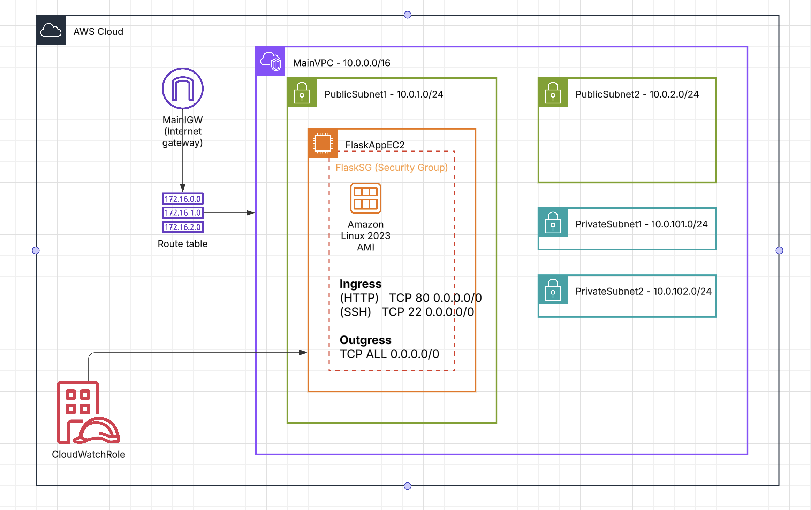

# application-boilerplate

A boilerplate Terraform template that provisions a frontend app through static web hosting and a backend service.

## Overview

This repository contains Terraform templates that help you quickly deploy a frontend static website and a backend service using AWS infrastructure. The frontend app is served via AWS S3, CloudFront for content delivery, and Route 53 for DNS management. 

## Frontend Setup

The static frontend app is described in detail in the following article:  
[Deploy a Static Website with AWS S3, CloudFront, and Terraform](https://denisgulev.com/static-website-with-aws-s3-cloudfront-and-terraform/).

In this article, you'll find a step-by-step guide on how to set up an S3-backed static website using Terraform, including CloudFront distribution, DNS configuration with Route 53, and more.

### Diagram


## Backend Setup

The backend service is deployed on a single EC2 instance running a simple Python Flask application. This backend architecture is designed to be minimal yet production-ready, including a robust networking layer, proper IAM permissions, and logging capabilities. 

All infrastructure components — from networking to compute and security — are fully managed and provisioned using Infrastructure as Code (IaC) through Terraform, ensuring consistent, repeatable, and easily maintainable deployments.

The backend app is described in detail in the following article:  
[Deploy an EC2 Instance with internet access](https://denisgulev.com/deploy-flask-backend-on-aws-ec2-with-terraform/).

### Architecture Components
- **EC2 Instance**: Hosts a Flask application.
- **Networking Layer**:
   - **VPC**: A dedicated Virtual Private Cloud for isolation and security.
   - **Public Subnets**: For resources that require direct access to the internet, including the EC2 instance.
   - **Private Subnets**: Reserved for future use, such as databases or internal services that shouldn’t be publicly accessible.
   - **Security Group**: Controls traffic to the EC2 instance with:
   - **Ingress Rules**: Allow HTTP (port 80) and SSH (port 22) access.
   - **Egress Rule**: Allows all outbound traffic.
   - **Internet Gateway**: Provides internet connectivity for the VPC.
   - **Route Table & Associations**: Routes traffic appropriately within the VPC and to the internet.
   - **IAM Role**: An EC2 role attached to the instance, granting permissions to write logs to CloudWatch Logs for better monitoring and observability.

### Flask Application

The Flask backend exposes a single API endpoint as an example of a backend service. It is served using Gunicorn, a WSGI HTTP server for Python, behind Nginx, which acts as a reverse proxy for better performance and security.

### Diagram



## How to Use

1. Clone this repository:
   ```bash
   git clone https://github.com/your-username/application-boilerplate.git
   cd application-boilerplate
   ```
2.	Customize the variables in the frontend and backend directories to suit your needs.
3.	Follow the instructions in the linked article to deploy the frontend static website.
4.	Follow the instructions in the linked article to deploy the backend service.


## 📌 Future Developments  

- **Connect the Static Frontend with the Backend API**  
  - Expose backend API under a proper domain (e.g., `api.example.com`).  
  - Configure CORS settings to allow frontend-backend communication.  
  - Update frontend to interact with backend endpoints.  

- **Implement CI/CD Pipelines for Frontend and Backend**  
  - Automate frontend deployments (S3 + CloudFront invalidation) using GitHub Actions
  - Automate backend EC2 updates and infrastructure changes via Terraform pipelines.  
  - Ensure zero-downtime deployments and rollback mechanisms.  

- **Add Monitoring, Logging, and Alerts**  
  - Enable detailed **CloudWatch Logs** for backend (Nginx, Gunicorn, Flask).  
  - Set up **CloudWatch Alarms** for critical metrics (CPU, memory, HTTP errors).  
  - Configure notification systems (e.g., **SNS**, email, Slack) for alerts.  

- **Security Hardening**  
  - Apply least privilege principles to IAM roles and security groups.  
  - Enable HTTPS for backend and frontend (SSL/TLS via ACM).  
  - Add security headers, rate limiting, and request validation to backend (Nginx/Flask).  
  - Consider adding **AWS WAF** and API throttling for additional protection.  
